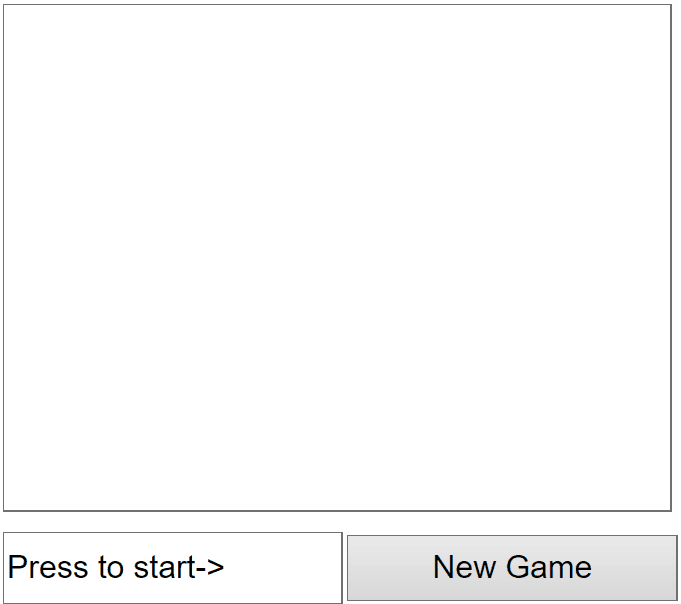

# StopTheVirusJS
This was a project for first semester's computer science class. This text adventure was written in Java, but I decided to port it to JS and test my skills. Also, I wasn't sure if it's ok to show the original code here. 1st semester, codings...

Goal of the original exercise was to understand classes and objects. Also how to handle interfaces, structure data correctly (like, which objects stores item information?). Translating all these concepts (especially those that were given in Java) to JavaScript, was fascinating - similar to translating a real-life language.

GIF animation of a JavaScript version of my Java exam project.

This version is rudimentary playable on a mobile phone. Sure, I'm still far from having a "fully responsible" web game/page, but it was a nice proof that I understood both languages well enough in the first semester already. There were plans to extend this with fellow students some day!
